# VHS Theme Preview

Automatically provides a preview of the default [VHS][https://github.com/charmbracelet/vhs] themes. Currently some templates listed in [THEMES.md][https://github.com/charmbracelet/vhs/blob/main/THEMES.md] are not available and not possible to render. 

## Themes

### 3024 Day

### 3024 Night

### Aardvark Blue

### Abernathy
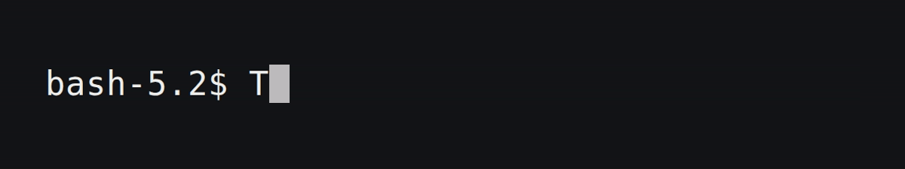
### Adventure

### AdventureTime
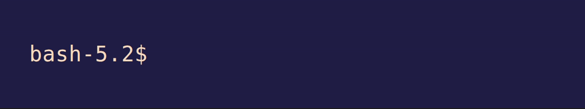
### Afterglow

### Alabaster
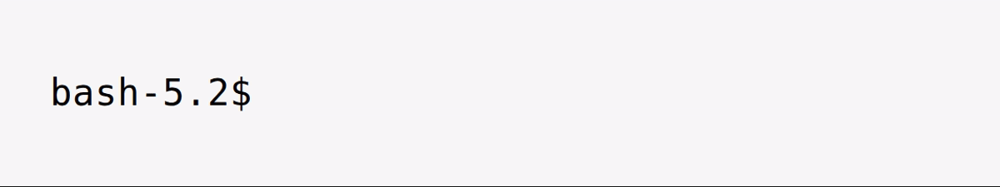
### AlienBlood
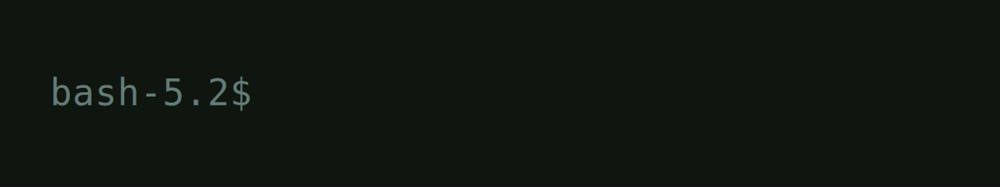
### Andromeda
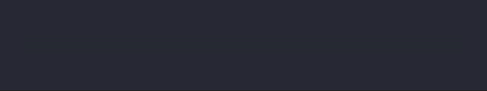
### Apple Classic

### Argonaut
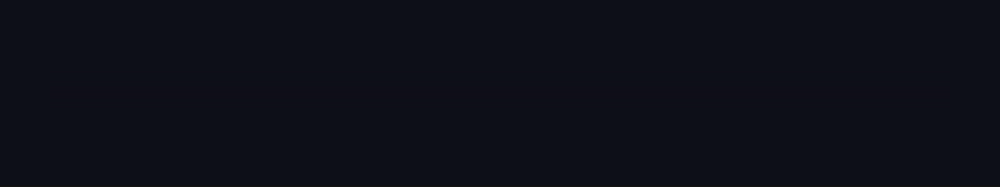
### Arthur
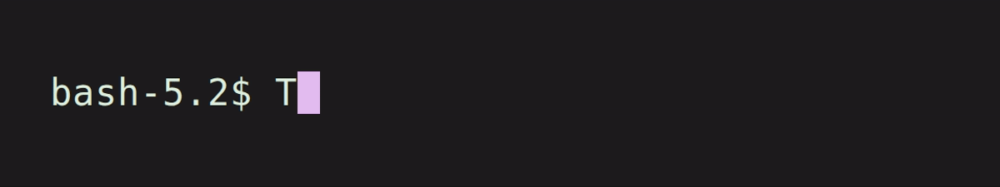
### AtelierSulphurpool

### Atom
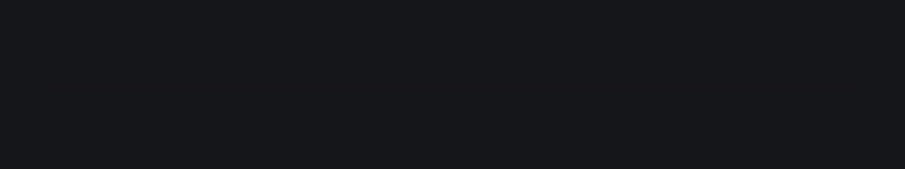
### AtomOneLight

### Aurora
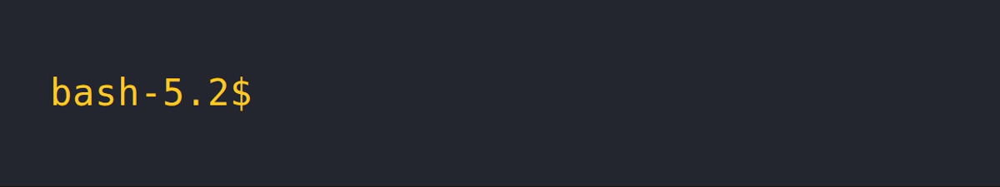
### Ayu Mirage

### Banana Blueberry

### Batman
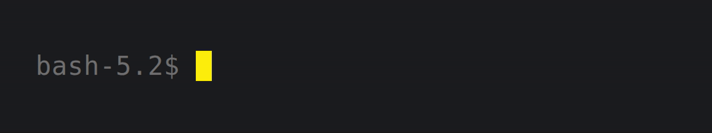
### Belafonte Day

### Belafonte Night

### BirdsOfParadise
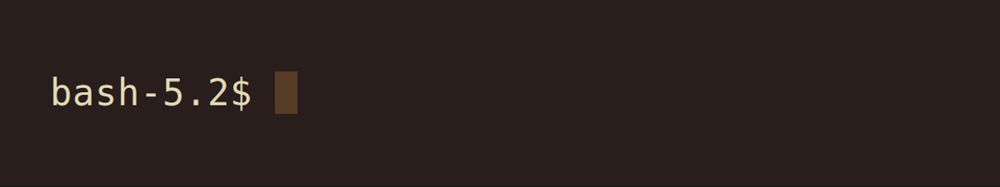
### Blazer
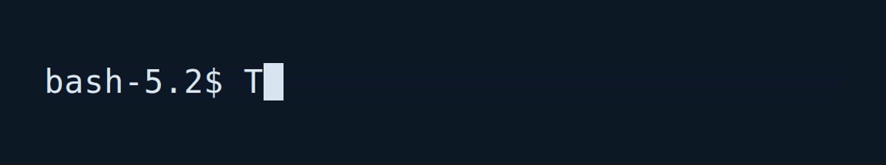
### BlueBerryPie
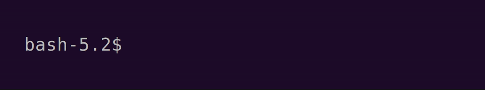
### BlueDolphin
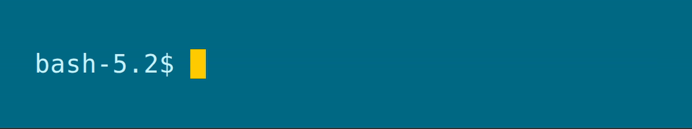
### Blue Matrix

### BlulocoDark

### BlulocoLight
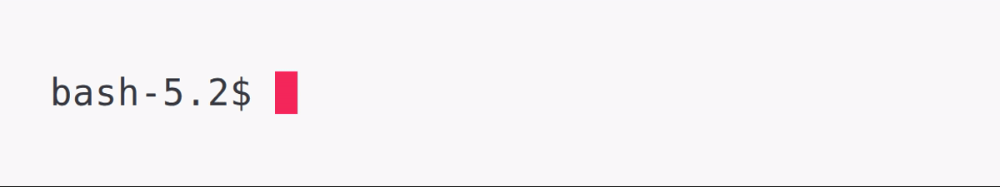
### Borland
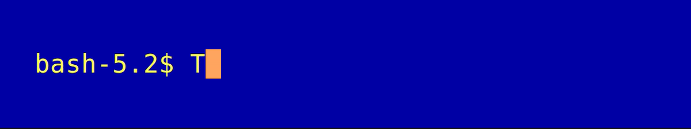
### Breeze
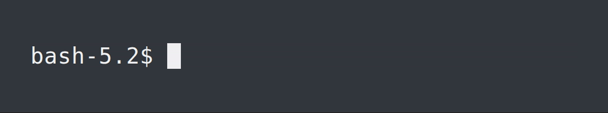
### Bright Lights

### Broadcast
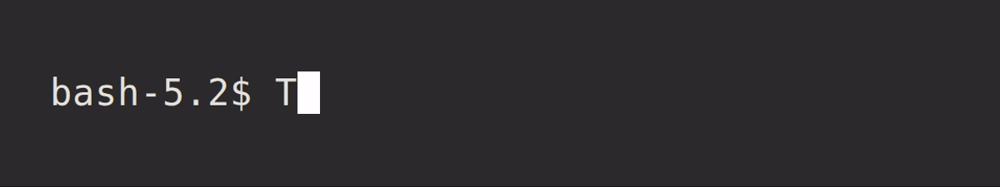
### Brogrammer
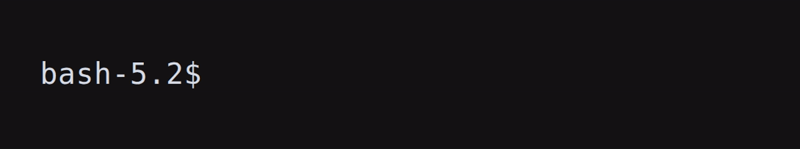
### Bubbles
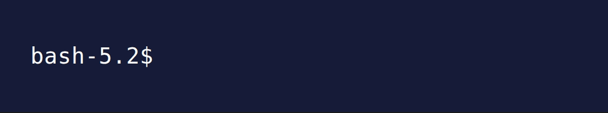
### Builtin Dark

### Builtin Light

### Builtin Pastel Dark

### Builtin Solarized Dark

### Builtin Solarized Light

### Builtin Tango Dark

### Builtin Tango Light

### C64
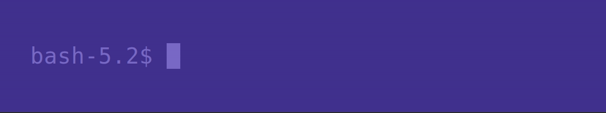
### CGA
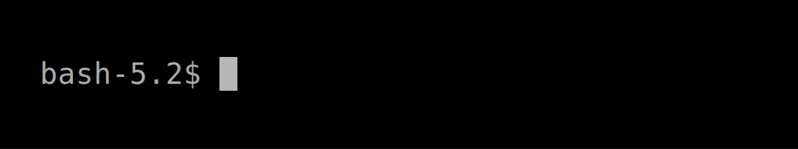
### CLRS
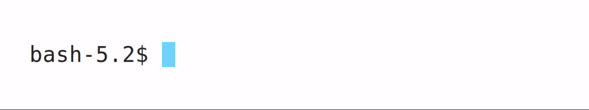
### Calamity
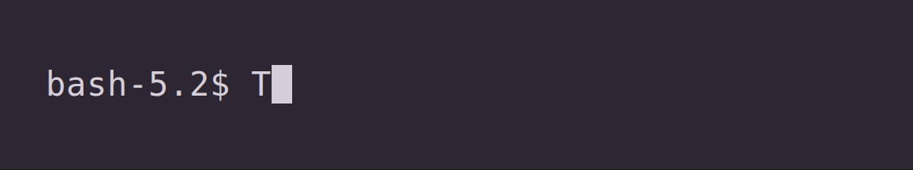
### Catppuccin Frappe

### Catppuccin Latte

### Catppuccin Macchiato

### Catppuccin Mocha

### Chalk
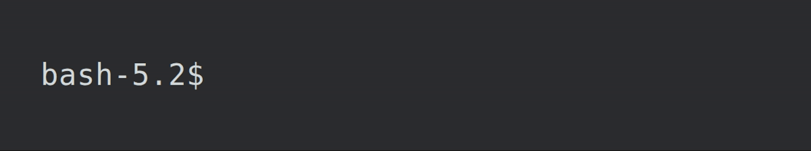
### Chalkboard
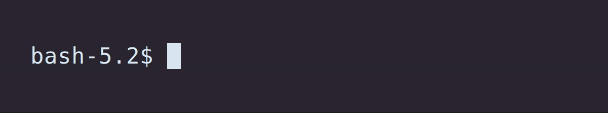
### ChallengerDeep
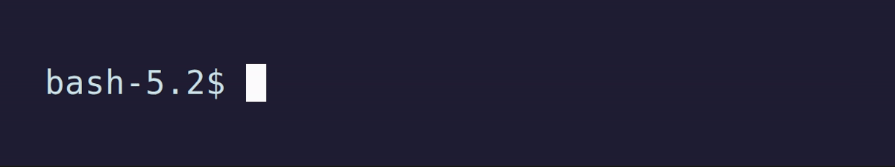
### Chester
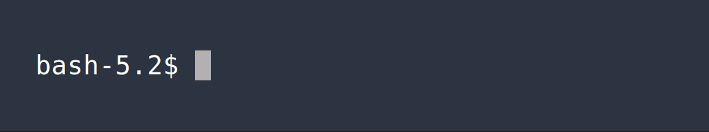
### Ciapre
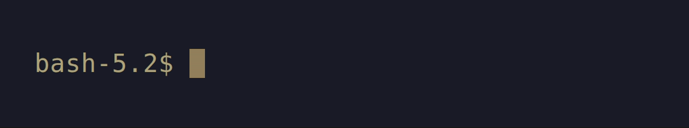
### Cobalt2
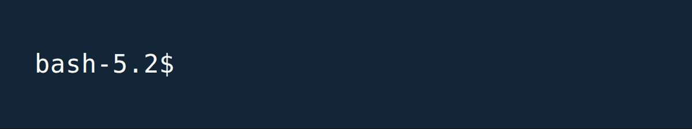
### Cobalt Neon

### Contrast Light

### CrayonPonyFish
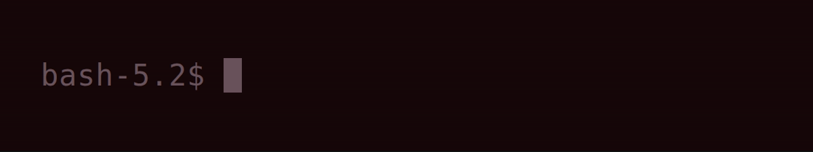
### Crystal Violet

### Cyber Cube

### CyberPunk2077
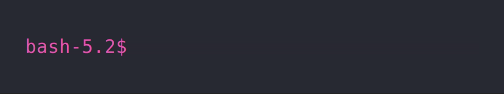
### Cyberdyne
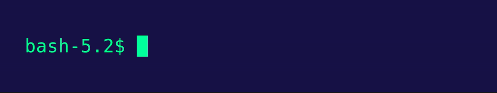
### Dark+

### Dark Pastel

### Darkside

### Desert

### DimmedMonokai

### Django

### DjangoRebornAgain

### DjangoSmooth

### DoomOne

### Doom Peacock

### DotGov

### Dracula+

### Dracula

### DraculaPlus

### Duotone Dark

### ENCOM

### Earthsong

### Elemental

### Elementary

### Espresso

### Espresso Libre

### Everblush

### Fahrenheit

### Fairyfloss

### Fideloper

### FirefoxDev

### Firewatch

### FishTank

### Flat

### Flatland

### Floraverse

### ForestBlue

### Framer

### FrontEndDelight

### FunForrest

### Galaxy

### Galizur

### Ganyu

### GitHub Dark

### Github

### Glacier

### Glorious

### Grape

### Grass

### Grey-green

### GruvboxDark

### GruvboxDarkHard

### Gruvbox Light

### Guezwhoz

### HaX0R_BLUE

### HaX0R_GR33N

### HaX0R_R3D

### Hacktober

### Hardcore

### Harper

### Highway

### Hipster Green

### Hivacruz

### Homebrew

### Hopscotch.256

### Hopscotch

### Horizon

### Hurtado

### Hybrid

### Hyper

### IC_Green_PPL

### IC_Orange_PPL

### IR_Black

### Jackie Brown

### Japanesque

### Jellybeans

### JetBrains Darcula

### Juicy Colors

### Kanagawa

### Kibble

### Kolorit

### Konsolas

### Lab Fox

### Laser

### Later This Evening

### Lavandula

### LiquidCarbon

### LiquidCarbonTransparent

### LiquidCarbonTransparentInverse

### Man Page

### Mariana

### Material

### MaterialDark

### MaterialDarker

### MaterialDesignColors

### MaterialOcean

### Mathias

### Medallion

### Mirage

### Misterioso

### Molokai

### MonaLisa

### Monokai Cmder

### Monokai Pro (Filter Octagon)

### Monokai Pro (Filter Ristretto)

### Monokai Pro

### Monokai Remastered

### Monokai Soda

### Monokai Vivid

### Moonlight II

### N0tch2k

### Neon

### Neopolitan

### Neutron

### NightLion v1

### NightLion v2

### Night Owlish Light

### Nocturnal Winter

### Novel

### Obsidian

### Ocean

### Oceanic-Next

### OceanicMaterial

### Ollie

### OneDark

### OneHalfDark

### OneHalfLight

### OneStar

### Operator Mono Dark

### Overnight Slumber

### PaleNightHC

### Pandora

### Paraiso Dark

### PaulMillr

### PencilDark

### PencilLight

### Peppermint

### Piatto Light

### Pnevma

### Popping and Locking

### Primer

### Pro

### Pro Light

### Purple Rain

### QB64 Super Dark Blue

### Rapture

### Raycast_Dark

### Raycast_Light

### Red Alert

### Red Planet

### Red Sands

### Relaxed

### Retro

### Retrowave

### Rippedcasts

### Rose Pine

### Rouge 2

### Royal

### Ryuuko

### Sakura

### Scarlet Protocol

### SeaShells

### Seafoam Pastel

### Serendipity Midnight

### Serendipity Morning

### Serendipity Sunset

### Seti

### Shaman

### Slate

### SleepyHollow

### Smyck

### Snazzy

### SoftServer

### Solarized Darcula

### Solarized Dark - Patched

### Solarized Dark Higher Contrast

### Sonoran Gothic

### Sonoran Sunrise

### SpaceGray

### SpaceGray Eighties

### SpaceGray Eighties Dull

### Spacedust

### Spiderman

### Spring

### Square

### Sublette

### Subliminal

### Sundried

### Symfonic

### SynthwaveAlpha

### Tango Adapted

### Tango Half Adapted

### Teerb

### Terminal Basic

### Thayer Bright

### The Hulk

### Tinacious Design (Dark)

### Tinacious Design (Light)

### TokyoNight

### TokyoNightLight

### TokyoNightStorm

### Tomorrow

### Tomorrow Night

### Tomorrow Night Blue

### Tomorrow Night Bright

### Tomorrow Night Burns

### Tomorrow Night Eighties

### ToyChest

### Treehouse

### Twilight

### Ubuntu

### UltraDark

### UltraViolent

### UnderTheSea

### Unholy

### Unikitty

### Urple

### Vaughn

### VibrantInk

### Violet Dark

### Violet Light

### WarmNeon

### Wez

### Whimsy

### WildCherry

### Wombat

### Wryan

### Zenburn

### Zeonica

### arcoiris

### ayu

### ayu_light

### catppuccin-frappe

### catppuccin-latte

### catppuccin-macchiato

### catppuccin-mocha

### coffee_theme

### coolnight

### cyberpunk

### darkermatrix

### darkmatrix

### deep

### duckbones

### h4rithd.com

### h4rithd

### iTerm2 Dark Background

### iTerm2 Default

### iTerm2 Light Background

### iTerm2 Pastel Dark Background

### iTerm2 Smoooooth

### iTerm2 Solarized Dark

### iTerm2 Solarized Light

### iTerm2 Tango Dark

### iTerm2 Tango Light

### iceberg-dark

### iceberg-light

### idea

### idleToes

### jubi

### kanagawabones

### lovelace

### matrix

### midnight-in-mojave

### neobones_dark

### neobones_light

### niji

### nord-light

### nord

### primary

### purplepeter

### rebecca

### rose-pine-dawn

### rose-pine-moon

### rose-pine

### seoulbones_dark

### seoulbones_light

### shades-of-purple

### synthwave-everything

### synthwave

### tokyonight-day

### tokyonight-storm

### tokyonight

### vimbones

### wilmersdorf

### zenbones

### zenbones_dark

### zenbones_light

### zenburned

### zenwritten_dark

### zenwritten_light

